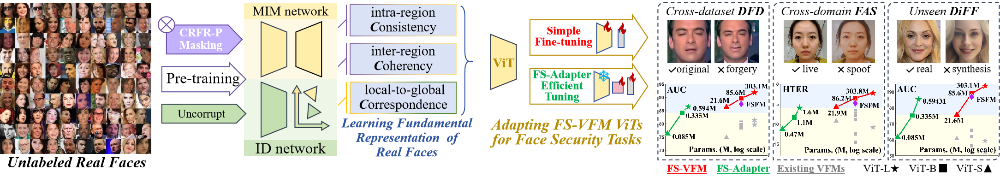

<div align="center">

# FSVFM: Scalable Face Security Vision Foundation Model for Deepfake, Diffusion, and Spoofing Detection

[Gaojian Wang](https://scholar.google.com/citations?user=tpP4cFQAAAAJ&hl=zh-CN&oi=ao)<sup>1,2</sup> &emsp; [Feng Lin](https://flin.group/)<sup>1,2</sup> &emsp; [Tong Wu](https://github.com/Coco-T-T?tab=repositories)<sup>1,2</sup> &emsp;
[Zhisheng Yan](https://mason.gmu.edu/~zyan4/)<sup>3</sup> &emsp; [Kui Ren](https://scholar.google.com/citations?user=uuQA_rcAAAAJ&hl=zh-CN&oi=sra)<sup>1,2</sup>  


<sup>1</sup>State Key Laboratory of Blockchain and Data Security, Zhejiang University <br>
<sup>2</sup>Hangzhou High-Tech Zone (Binjiang) Institute of Blockchain and Data Security <br>
<sup>3</sup>George Mason University
</div>

<div align="center">
<a href='https://fsfm-3c.github.io/fsvfm.html'></a>
<a href='https://arxiv.org/pdf/2510.10663'></a>
<a href='https://openaccess.thecvf.com/content/CVPR2025/papers/Wang_FSFM_A_Generalizable_Face_Security_Foundation_Model_via_Self-Supervised_Facial_CVPR_2025_paper.pdf'></a>
</div>
<div align="center">
<a href="./LICENSE">  </a>
<a href='https://huggingface.co/Wolowolo/fsfm-3c'></a>
</div>
<div align="center">
<a href='https://huggingface.co/spaces/Wolowolo/FSFM-3C_facial_masking_for_MIM'></a>
<a href='https://huggingface.co/spaces/Wolowolo/FSFM-deepfake_diffusion_spoof_face_detection'></a>
</div>
 <br>
<div align="center">

This is the implementation of **[FSVFM](https://fsfm-3c.github.io/fsvfm.html)**, an extended version of our previous [FSFM](https://fsfm-3c.github.io/) work published at CVPR25.
</div>

## Release🎉
*  **2025-10**: The pre-trained/fine-tuned models of the paper implementation are also available at <a href='https://huggingface.co/Wolowolo/fsfm-3c'></a>
*  **2025-10**: All codes, including data-preprocessing, pre-training, fine-tuning, efficient-tuning, and testing, are released at [this page](https://github.com/wolo-wolo/FSFM-CVPR25/tree/FSVFM-extension). <br> ⛔ **Note that use `git clone --branch FSVFM-extension --single-branch https://github.com/wolo-wolo/FSFM-CVPR25.git`**
*  **2025-10**: Our paper is available at <a href='https://arxiv.org/abs/2510.10663'></a>

## Table of Contents
  - [🔧 Installation](#installation)
  - [⏳ FS-VFM Pre-training](#fsvfm-pretraining)
    - [⚫ Pre-training Data](#pre-training-data)
      - [⬇️ Dataset Preparation](#pt-dataset-preparation)
      - [⬇️ Toolkit Preparation](#toolkit-preparation)
      - [📁 Folder Structure](#folder-structure)
      - [🗂️ Make Pre-training Dataset](#make-pre-training-dataset)
    - [⚫ Pre-training Model](#pre-training-model)
      - [🔄 Pre-training from Scratch (➕FS-VFM Extension🔼)](#pre-training-from-scratch)
      - [🚀 Model and Data Scaling](#model-and-data-scaling)
      - [💾 Pre-training/Resume from Checkpoint](#resume-for-pretraining)
    - [🤗 Pre-trained Checkpoints (➕FS-VFM Extension🔼)](#pre-trained-model)
      - [📥 Download Manually](#download-manually)
      - [💻 Download Script](#download-script)
  - [⚡ Simple Fine-tuning Pre-trained FS-VFM (FSFM) ViTs for Downstream Tasks](#fsfm-finetuning)
    - [⚫ Cross-Dataset Deepfake Detection (DfD)](#dfd)
      - [⬇️ Dataset Preparation](#dfd-dataset-preparation)
      - [⏩ Fine-tuning&Evaluation Packaged Scripts (➕FS-VFM Extension🔼)](#dfd-scripts)
      - [⚡ Fine-tuning](#dfd-finetuning)
        - [✨ Fine-tuning with different dataset structure](#finetuning-different-dataset) 
      - [📊 Cross-Datasets Evaluation](#dfd-testing)
    - [⚫ Unseen Diffusion Facial Forgery Detection (DiFF)](#diff)
      - [⬇️ Dataset Preparation](#diff-dataset-preparation)
      - [⏩ Fine-tuning&Evaluation Packaged Scripts (➕FS-VFM Extension🔼)](#diff-scripts)
      - [⚡ Fine-tuning](#diff-finetuning)
      - [📊 Cross-Datasets Evaluation](#diff-testing)
    - [⚫ Cross-Domain Face Anti-Spoofing (FAS)](#fas)
      - [⬇️ Dataset Preparation](#fas-dataset-preparation)
      - [⏩ Fine-tuning and Evaluation](#fas-finetuning)
  - [💨 FS-Adapter Efficient Fine-tuning (➕FS-VFM Extension🔼)](#fsadapter-finetuning)
      - [⏩ FS-Adapter PEFT for Cross-Dataset Deepfake Detection (DfD)](#dfd-peft-scripts)
      - [⏩ FS-Adapter PEFT for Unseen Diffusion Facial Forgery Detection (DiFF)](#diff-peft-scripts)
      - [⏩ FS-Adapter PEFT for Cross-Domain Face Anti-Spoofing (FAS)](#fas-peft-scripts)
  - [Citation](#citing-fsfm-3c)

---

# 🔧 Installation 
<a id="installation"></a>
Git clone this repository, create a conda environment, and activate it via the following command: 
```bash
git clone --branch FSVFM-extension --single-branch https://github.com/wolo-wolo/FSFM-CVPR25.git
cd FSFM-CVPR25/
conda create -n fsfm3c python=3.9.21
conda activate fsfm3c
pip install torch==1.13.1+cu117 torchvision==0.14.1+cu117 torchaudio==0.13.1 --extra-index-url https://download.pytorch.org/whl/cu117 # run this first. (our exp implementation)
pip install -r requirements.txt
```

---
#  🚀 FS-VFM Pre-training
<a id="fsvfm-pretraining"></a>
The implementation of pre-training FS-VFM (FSFM) ViT models from unlabeled facial images.

<a id="download-script"></a>

## ⚫ Pre-training Data 
<a id="pre-training-data"></a>

<details>
<a id="pt-dataset-preparation"></a>
<summary style="font-size: 20px; font-weight: bold;">⬇️ Dataset Preparation</summary>

>💡 FS-VFM (FSFM) can be readily pre-trained on various facial (images or videos) datasets and their combinations without annotations, 
learning a general facial representation that transcends specific domains or tasks. Thus, it can benefit from the 
larger scale and greater diversity of unlabeled faces widely available in the open world.

For paper implementation, we have pre-trained our model on the following datasets. Download these datasets optionally and refer to [Folder Structure](#folder-structure).
- [VGGFace2](https://github.com/ox-vgg/vgg_face2) _for main experiments (raw data: images)_  
- [FaceForensics++](https://github.com/ondyari/FaceForensics) _for our ablation studies (raw data: videos)_  
- [YoutubeFace](https://www.cs.tau.ac.il/~wolf/ytfaces/) _for data scaling testing (raw data: frames)_
</details>

<details>
<a id="toolkit-preparation"></a>
<summary style="font-size: 20px; font-weight: bold;">⬇️ Toolkit Preparation</summary>

We use **DLIB** for face detection and the **FACER** toolkit for face parsing. Download the **FACER** toolkits in advance.
- [FACER](https://github.com/FacePerceiver/facer)
```bash
cd /datasets/pretrain/preprocess/tools
git clone https://github.com/FacePerceiver/facer
```
</details>

<details>
<a id="folder-structure"></a>
<summary style="font-size: 20px; font-weight: bold;">📁 Folder Structure</summary>

> You can organize the Folder structure in `/datasets/pretrain/preprocess/config/default.py`

The following is the **default Folder Structure**. The paths in each directory are described in the comments. 
```bash
datasets/
├── data/
│   ├── VGG-Face2/    # VGGFace2
│   │   ├── train/    # download data
│   │   ├── test/    # download data
│   │   └── facial_images/    # facial images (train + test) (automatic creating by pretrain/preprocess/dataset_preprocess.py)
│   │
│   ├── FaceForensics/    # FF++
│   │   ├── dataset/    # download splits
│   │   │   └── splits/
│   │   │       ├── train.json
│   │   │       ├── val.json
│   │   │       └── test.json
│   │   ├── original_sequences/    # download data 
│   │   │   └── youtube/    # real faces (we use c23 version) for pre-training
│   │   │       └── c23/
│   │   ├── manipulated_sequences/    # download data, fake faces for deepfake detection, not used in pre-training
│   │   └── facial_images_split/    # facial images (automatic creating by pretrain/preprocess/dataset_preprocess.py)
│   │
│   └── YoutubeFace/    # YoutubeFace
│       ├── frame_images_DB/    # download data 
│       └── facial_images/    # facial images (automatic creating by pretrain/preprocess/dataset_preprocess.py)
│
├── pretrain/preprocess/
│   ├── config/
│   │   ├── __init__.py
│   │   └── default.py    # define folder structure
│   ├── tools/
│   │   ├── facer/    # download FACER toolkit to here
│   │   └── util.py    # Frame and Face Extraction functions
│   ├── dataset_preprocess.py    # for face extraction from images or videos
│   └── face_parse.py    # for face parsing to make pre-training data
│
└── pretrain_datasets/    # final pre-training data (automatic creating by face_parse.py)
    ├── FaceForensics_youtube/    # FF++_o data for pre-training
    ├── YoutubeFace/    # YoutubeFace (YTF) data for pre-training
    └── VGGFace2/    # VGGFace2 (VF2) data for pre-training
```
</details>

<details>
<a id="make-pre-training-dataset"></a>
<summary style="font-size: 20px; font-weight: bold;">🗂️ Make Pre-training Dataset</summary>
  
<details style="margin-left: 20px;">
<summary style="font-size: 18px; font-weight: bold;">1) 🦱 Face Extraction</summary>
    
We use **DLIB** for face detection with a 30% addition cropping size.  Run `/datasets/pretrain/preprocess_dlib/dataset_preprocess.py` to extract faces from images or videos:
```bash
cd /datasets/pretrain/
python dataset_preprocess.py --dataset [VF2, FF++_o, YTF]
```
The facial images from each dataset:
- **VF2** : ~300W facial images, **VGGFace2**, including the full train and test subsets
- **YTF** : ~60W facial images, **YouTubeFace**, including 3,425 videos from YouTube, already broken to frames
- **FF++_o** : ~10W facial images for 128_frames per video, ~43W for all_frames per video, from the **original YouTube subset** of **FaceForensics++ (FF++) c23 (HQ)** version, 
includes 720 training and 140 validation videos
_(~10W serves for our some ablations due to limited computational resources)_ 
  > You can specific the `FF_compression` and `FF_num_frames ` in `/datasets/pretrain/preprocess/config/default.py`,
  > as an example for preprocessing facial video dataset.

</details>
  
<details style="margin-left: 20px;">
<summary style="font-size: 18px; font-weight: bold;">2) 🧑‍ Face Parsing</summary>

We use the **FACER** toolkit for face parsing.
Cropped faces are resized to 224×224, and parsing maps are saved as .npy files, enabling efficient facial masking during pre-training. 
Run `/datasets/pretrain/preprocess_dlib/face_parse.py` for processing:
```bash
python face_parse.py --dataset [FF++_o, YTF, VF2] 
# or CUDA_VISIBLE_DEVICES=0 python face_parse.py --dataset [FF++_o, YTF, VF2]
```
The resulting `/datasets/pretrain_datasets/` folder structure should finally be:
```
pretrain_datasets/                           
└── specific_dataset
   ├── images (3*224*224 .png)
   ├── parsing_maps (1*224*224 .npy)
   └── vis_parsing_maps (optional for visualization)
```
</details>
</details>

## ⚫ Pre-training Model
<a id="pre-training-model"></a>

<details>
<a id="pre-training-from-scratch"></a>
<summary style="font-size: 20px; font-weight: bold;">🔄 Pre-training from Scratch</summary>

- **Pre-training Scripts (➕FS-VFM Extension🔼)** 
    ```bash
    cd ./fsvfm/pretrain
    # To pre-train our FS-VFM ViT-S:
    bash scripts/pretrain_FSVFM_ViT-S.sh
    # To pre-train our FS-VFM ViT-B:
    bash scripts/pretrain_FSVFM_ViT-B.sh  # (Set the --epochs to 400 exactly our previous FSFM ViT-B)
    # To pre-train our FS-VFM ViT-L:
    bash scripts/pretrain_FSVFM_ViT-L.sh
    ```

- **Pre-training Arguments** 

    You could also run the `main_pretrain.py` with following arguments to pre-train the model:
    ```bash
    CUDA_VISIBLE_DEVICES=0,1,2,3 OMP_NUM_THREADS=1 python -m torch.distributed.launch --node_rank=0 --nproc_per_node=4 main_pretrain.py \
    --batch_size 256 \
    --accum_iter 4 \
    --epochs 600 \
    --model fsfm_vit_base_patch16 \
    --input_size 224 \
    --mask_ratio 0.75 \
    --norm_pix_loss \
    --weight_sfr 0.007 \
    --weight_cl 0.1 \
    --cl_loss SimSiam \
    --weight_decay 0.05 \
    --blr 1.5e-4 \
    --warmup_epochs 40 \
    --pretrain_data_path ../../datasets/pretrain_datasets/'{VGG-Face2, YoutubeFace, FaceForensics_youtube/128_frames/c23}'  \
    --output_dir 'path to save pretrained model ckpt and logs}' # default to: /fsfm-3c/pretrain/checkpoint/$USR/experiments_pretrain/$PID$
    ```
  - We use `--accum_iter` to maintain the effective batch size, which is 256 `batch_size` (per gpu) * 1 `nodes` * 4 (gpus per node) * 4 `accum_iter` = 4096.
  - `blr` is the base learning rate. The actual `lr` is computed by the [linear scaling rule](https://arxiv.org/abs/1706.02677): `lr` = `blr` * effective batch size / 256.
  - Here we use `--norm_pix_loss` as the target for better representation learning. To train a baseline model (e.g., for visualization), use pixel-based construction and turn off `--norm_pix_loss`.
  - In `--output_dir`, we save the weights of online network and target network separately to `checkpoint-$epoch$.pth` (**for downstream tasks**) and `checkpoint-te-$epoch$.pth` (for resume pre-training), respectively.
  We also save the weights with min pre-training loss to `checkpoint-min_pretrain_loss.pth` and `checkpoint-te-min_pretrain_loss.pth`, respectively.
</details>

<details>
<a id="model-and-data-scaling"></a>
<summary style="font-size: 20px; font-weight: bold;">🚀 Model and Data Scaling</summary>

- **Model Scaling.** To pre-train ViT-Small, ViT-Base, ViT-Large, or ViT-Huge, set `--model` to one of:
    ```
    --model [fsfm_vit_small_patch16, fsfm_vit_base_patch16, fsfm_vit_large_patch16, fsfm_vit_huge_patch14 (with --patch_size 14)]
    ```

- **Data Scaling.** 
  - FS-VFM (FSFM) can be readily pre-trained on various facial image/video datasets (requires real faces only), you can follow [⚫Pre-training Data](#pre-training-data) for preparation. 
  - To pre-train the model on arbitrary combinations of various datasets, just add `--pretrain_data_path` like:
    ```bash
    CUDA_VISIBLE_DEVICES=0,1,2,3 OMP_NUM_THREADS=1 python -m torch.distributed.launch --node_rank=0 --nproc_per_node=4 main_pretrain.py \
        -- (Omit other params...)
        --pretrain_data_path ../../datasets/pretrain_datasets/VGG-Face2 \
        --pretrain_data_path ../../datasets/pretrain_datasets/YoutubeFace \
        --pretrain_data_path ../../datasets/pretrain_datasets/FaceForensics_youtube/128_frames/c23
    ```
</details>

<details>
<a id="resume-for-pretraining"></a>
<summary style="font-size: 20px; font-weight: bold;">💾  Pre-training/Resume from Checkpoint</summary>

- To continue pre-training from pre-trained/model checkpoints:

    ```bash
    CUDA_VISIBLE_DEVICES=0,1,2,3 OMP_NUM_THREADS=1 python -m torch.distributed.launch --node_rank=0 --nproc_per_node=4 main_pretrain.py \
        -- (Omit other params...)
        --resume 'path_to_model_ckpt/checkpoint-$epoch$.pth' \
        --resume_target_network 'path_to_model_ckpt/checkpoint-te-$epoch$.pth' \
    ```
</details>

<a id="pretrained-checkpoints"></a>

## 🤗 Pre-trained Checkpoints 
<a id="pre-trained-model"></a>

<details>
<a id="download-manually"></a>
<summary style="font-size: 20px; font-weight: bold;">📥 Download Manually (➕FS-VFM Extension🔼)</summary>

We provide the model weights on the <a href='https://huggingface.co/Wolowolo/fsfm-3c'></a>
 and will continuously update them, which can be downloaded from the following links (default placed in `./fsvfm/pretrain/checkpoint/pretrained_models/`):

|     Backbone      | Pre-trained data |  Epochs  |                                                         Online Network 🤗                                                          |                                                            Target Network 🤗                                                             |                                                                  Normalize 🤗                                                                   |
|:-----------------:|:----------------:|:--------:|:----------------------------------------------------------------------------------------------------------------------------------:|:----------------------------------------------------------------------------------------------------------------------------------------:|:-----------------------------------------------------------------------------------------------------------------------------------------------:|
|  ViT-B/16 (FSFM)  |     VGGFace2     |   400    |       [checkpoint-400.pth](https://huggingface.co/Wolowolo/fsfm-3c/blob/main/pretrained_models/VF2_ViT-B/checkpoint-400.pth)       |       [checkpoint-te-400.pth](https://huggingface.co/Wolowolo/fsfm-3c/blob/main/pretrained_models/VF2_ViT-B/checkpoint-te-400.pth)       |       [pretrain_ds_mean_std.txt](https://huggingface.co/Wolowolo/fsfm-3c/blob/main/pretrained_models/VF2_ViT-B/pretrain_ds_mean_std.txt)        |
|     Extension     |
| ViT-S/16 (FS-VFM) |     VGGFace2     |   600    | [checkpoint-600.pth](https://huggingface.co/Wolowolo/fsfm-3c/blob/main/pretrained_models/FS-VFM_ViT-S_VF2_600e/checkpoint-599.pth) | [checkpoint-te-600.pth](https://huggingface.co/Wolowolo/fsfm-3c/blob/main/pretrained_models/FS-VFM_ViT-S_VF2_600e/checkpoint-te-599.pth) | [pretrain_ds_mean_std.txt](https://huggingface.co/Wolowolo/fsfm-3c/blob/main/pretrained_models/FS-VFM_ViT-S_VF2_600e/pretrain_ds_mean_std.txt)  |
| ViT-B/16 (FS-VFM) |     VGGFace2     |   600    | [checkpoint-600.pth](https://huggingface.co/Wolowolo/fsfm-3c/blob/main/pretrained_models/FS-VFM_ViT-B_VF2_600e/checkpoint-600.pth) | [checkpoint-te-600.pth](https://huggingface.co/Wolowolo/fsfm-3c/blob/main/pretrained_models/FS-VFM_ViT-B_VF2_600e/checkpoint-te-600.pth) | [pretrain_ds_mean_std.txt](https://huggingface.co/Wolowolo/fsfm-3c/blob/main/pretrained_models/FS-VFM_ViT-B_VF2_600e/pretrain_ds_mean_std.txt)  |
| ViT-L/16 (FS-VFM) |     VGGFace2     |   600    | [checkpoint-600.pth](https://huggingface.co/Wolowolo/fsfm-3c/blob/main/pretrained_models/FS-VFM_ViT-L_VF2_600e/checkpoint-599.pth) | [checkpoint-te-600.pth](https://huggingface.co/Wolowolo/fsfm-3c/blob/main/pretrained_models/FS-VFM_ViT-L_VF2_600e/checkpoint-te-599.pth) | [pretrain_ds_mean_std.txt](https://huggingface.co/Wolowolo/fsfm-3c/blob/main/pretrained_models/FS-VFM_ViT-L_VF2_600e/pretrain_ds_mean_std.txt)  |


> - For Downstream Tasks:
load the ViT weights from the Online Network and apply normalization from Normalize (instead of ImageNet's mean&std).
> - Resuming Weights for Continued Pre-training:
additionally, download the Target Network and refer to [Pre-training/Resume from Checkpoint](#resume-for-pretraining)
> - 💡 Further Improvements:
You can pre-train for more epochs, adopt smaller or larger ViTs, use more unlabeled real faces, and resize face images to a larger size. Due to computational limitations, we will also continue to update models.
</details>

<details>
<a id="download-script"></a>
<summary style="font-size: 20px; font-weight: bold;">💻 Download Script (➕FS-VFM Extension🔼)</summary>

The models can be downloaded from huggingface_hub `python /fsvfm/pretrain/download_pretrained_weitghts.py`:
```python
from huggingface_hub import hf_hub_download

# downloading the pre-trained FSFM-ViT-B_VF2_400e model (CVPR25 version):
hf_hub_download(repo_id="Wolowolo/fsfm-3c", filename="pretrained_models/VF2_ViT-B/checkpoint-400.pth",
                local_dir="./checkpoint/", local_dir_use_symlinks=False, resume_download=True)
hf_hub_download(repo_id="Wolowolo/fsfm-3c", filename="pretrained_models/VF2_ViT-B/checkpoint-te-400.pth",
                local_dir="./checkpoint/", local_dir_use_symlinks=False, resume_download=True)
hf_hub_download(repo_id="Wolowolo/fsfm-3c", filename="pretrained_models/VF2_ViT-B/pretrain_ds_mean_std.txt",
                local_dir="./checkpoint/", local_dir_use_symlinks=False, resume_download=True)

# downloading the pre-trained FS-VFM-ViT-S_VF2_600e model (FSFM-CVPR25 extension):
hf_hub_download(repo_id="Wolowolo/fsfm-3c", filename="pretrained_models/FS-VFM_ViT-S_VF2_600e/checkpoint-599.pth",
                local_dir="./checkpoint/", local_dir_use_symlinks=False, resume_download=True)
hf_hub_download(repo_id="Wolowolo/fsfm-3c", filename="pretrained_models/FS-VFM_ViT-S_VF2_600e/checkpoint-te-599.pth",
                local_dir="./checkpoint/", local_dir_use_symlinks=False, resume_download=True)
hf_hub_download(repo_id="Wolowolo/fsfm-3c", filename="pretrained_models/FS-VFM_ViT-S_VF2_600e/pretrain_ds_mean_std.txt",
                local_dir="./checkpoint/", local_dir_use_symlinks=False, resume_download=True)

# downloading the pre-trained FS-VFM-ViT-B_VF2_600e model (FSFM-CVPR25 extension):
hf_hub_download(repo_id="Wolowolo/fsfm-3c", filename="pretrained_models/FS-VFM_ViT-B_VF2_600e/checkpoint-600.pth",
                local_dir="./checkpoint/", local_dir_use_symlinks=False, resume_download=True)
hf_hub_download(repo_id="Wolowolo/fsfm-3c", filename="pretrained_models/FS-VFM_ViT-B_VF2_600e/checkpoint-te-600.pth",
                local_dir="./checkpoint/", local_dir_use_symlinks=False, resume_download=True)
hf_hub_download(repo_id="Wolowolo/fsfm-3c", filename="pretrained_models/FS-VFM_ViT-B_VF2_600e/pretrain_ds_mean_std.txt",
                local_dir="./checkpoint/", local_dir_use_symlinks=False, resume_download=True)

# downloading the pre-trained FS-VFM-ViT-L_VF2_600e model (FSFM-CVPR25 extension):
hf_hub_download(repo_id="Wolowolo/fsfm-3c", filename="pretrained_models/FS-VFM_ViT-L_VF2_600e/checkpoint-599.pth",
                local_dir="./checkpoint/", local_dir_use_symlinks=False, resume_download=True)
hf_hub_download(repo_id="Wolowolo/fsfm-3c", filename="pretrained_models/FS-VFM_ViT-L_VF2_600e/checkpoint-te-599.pth",
                local_dir="./checkpoint/", local_dir_use_symlinks=False, resume_download=True)
hf_hub_download(repo_id="Wolowolo/fsfm-3c", filename="pretrained_models/FS-VFM_ViT-L_VF2_600e/pretrain_ds_mean_std.txt",
                local_dir="./checkpoint/", local_dir_use_symlinks=False, resume_download=True)
```

</details>

---
#  ⚡ Simple Fine-tuning Pre-trained FS-VFM (FSFM) ViTs for Downstream Tasks
<a id="fsfm-finetuning"></a>
The implementation of fine-tuning our pre-trained ViT model on various downstream face security-related tasks.


## ⚫ Cross-Dataset Deepfake Detection (DfD)
<a id="dfd"></a>

To evaluate the generalizability of our method across diverse deepfake detection scenarios, we follow the challenging 
cross-dataset setup. 

<details style="margin-left: 20px;">
<a id="dfd-dataset-preparation"></a>
<summary style="font-size: 20px; font-weight: bold;">⬇️ Dataset Preparation</summary>

For paper implementation, we fine-tune one detector on the FaceForensics++ (FF++, c23/HQ version) 
dataset and test it on unseen datasets: CelebDF-v2 (CDFv2), Deepfake Detection Challenge (DFDC), 
Deepfake Detection Challenge preview (DFDCp), and Wild Deepfake(WDF). 
Download these datasets and refer to [DfD Folder Structure](#dfd-folder-structure).
- [FaceForensics++ / DeepFakeDetection](https://github.com/ondyari/FaceForensics)
- [Celeb-DF (v1 & v2)](https://github.com/yuezunli/celeb-deepfakeforensics)
- [DeepFake Detection Challenge (Full & Preview)](https://ai.meta.com/datasets/dfdc/)
- [Deepfake in the Wild / Wild Deepfake](https://github.com/OpenTAI/wild-deepfake)
- [Celeb-DF++](https://github.com/OUC-VAS/Celeb-DF-PP) (➕FS-VFM Extension🔼)
</details>

<details style="margin-left: 20px;">
<a id="dfd-folder-structure"></a>
<summary style="font-size: 20px; font-weight: bold;">📁 DfD Folder Structure</summary>

> You can organize the Folder structure in `/datasets/finetune/preprocess/config/default.py`

The following is the **default Folder Structure** for deepfake detection. The paths in each directory are described in the comments. 
```bash
datasets/
├── data/
│   ├── Celeb-DF-v2/   # Celeb-DF (v2)
│   │   ├── Celeb-real/    # download data
│   │   ├── YouTube-real/    # download data
│   │   ├── Celeb-synthesis/    # download data 
│   │   └── List_of_testing_videos.txt    # download data
│   │
│   ├── Celeb-DF++/   # Celeb-DF++
│   │   ├── Celeb-real/    # download data
│   │   ├── YouTube-real/    # download data
│   │   ├── Celeb-synthesis/    # download data 
│   │   │   ├── FaceReenact/    # 7 manipulations
│   │   │   ├── FaceSwap/       # 8 manipulations
│   │   │   └── TalkingFace/    # 7 manipulations
│   │   └── List_of_testing_videos.txt    # download data
│   │
│   ├── DFDC/   # DeepFake Detection Challenge (Full)
│   │   └── test/   # download data
│   │       ├── ori_videos/   
│   │       ├── labels.csv
│   │       └── metadata.json
│   │
│   ├── DFDCP/   # DeepFake Detection Challenge (Preview)
│   │   ├── original_videos/    # download data
│   │   ├── method_A/    # download data
│   │   ├── method_B/    # download data
│   │   └── dataset.json   # download data
│   │
│   ├── deepfake_in_the_wild/   # DeepFake Detection Challenge (Preview)
│   │   ├── real_test/    # download data
│   │   └── fake_test/    # download data
│   │
│   └── FaceForensics/    # FF++
│       ├── dataset/    # download splits
│       │   └── splits/
│       │       ├── train.json
│       │       ├── val.json
│       │       └── test.json
│       ├── original_sequences/    # download data 
│       │   ├── youtube/    # videos of real faces in FF++
│       │   │   └── c23/
│       │   └── actors/
│       │       └── raw/    # videos of real faces in DFD (DeepFakeDetection) datasets
│       ├── manipulated_sequences/    # download data, videos of fake faces in FF++
│       │   ├── DeepFakes/
│       │   │   └── c23/
│       │   ├── Face2Face/
│       │   │   └── c23/
│       │   ├── FaceSwap/
│       │   │   └── c23/
│       │   ├── NeuralTextures/
│       │   │   └── c23/
│       │   └── DeepFakeDetection/    # videos of fake faces in DFD (DeepFakeDetection) datasets
│       │   │   └── raw/
│       └── facial_images_split/    # facial images (automatic creating by finetune/preprocess/dataset_preprocess.py)
│    
├── finetune/preprocess/
│   ├── config/
│   │   ├── __init__.py
│   │   └── default.py    # define folder structure
│   ├── tools/
│   │   └── util.py     # Frame and Face Extraction functions
│   └── dataset_preprocess.py    # to construct fine-tuning data (including train/val/test/) for DfD and DiFF tasks
│ 
└── finetune_datasets/    # final fine-tuning data (automatic creating by dataset_preprocess.py)
    └── deepfakes_detection/  #  data for DfD fine-tuning (automatic creating by finetune/preprocess/dataset_preprocess.py)
        ├── Celeb-DF++/
        ├── Celeb-DF-v2/                 
        ├── deepfake_in_the_wild/
        ├── DFDC/
        ├── DFDCP/
        └── FaceForensics/ 
```
</details>

<details style="margin-left: 20px;">
<summary style="font-size: 20px; font-weight: bold;">🗂️ Make Fine-tuning&Testing Dataset</summary>

We use DLIB for face detection with a 30% addition cropping size. Run `/datasets/finetune/preprocess/dataset_preprocess.py` to make train/val/test datasets 
for our downstream deepfakes detection task.

```bash
cd /datasets/finetune/preprocess

python dataset_preprocess.py --dataset FF++_all    # extracting faces from videos and making FF++ train/val/ sets 
# This would yield DS_FF++_all_cls/ dataset for our DfD model fine-tuning, placed in following folder:
# finetune_datasets/
# └── deepfakes_detection/                           
#     └── FaceForensics
#         └── $num$_frames/    # default $num$ is 32
#             └── DS_FF++_all_cls/
#                 └── $compression$/    # default $compression$ is c23 (there are three version in FF++/DFD: raw/c40/c23)
#                     ├── train/
#                     ├── val/
#                     └── test/ 

python dataset_preprocess.py --dataset [CelebDF++, CelebDFv2, DFDC, DFDC_P, WildDeepfake, CelebDF, DFD]   # extracting faces and making test sets
# This would yield testing set for our cross-dataset DfD evaluation. placed in following folder:
# finetune_datasets/
# └── deepfakes_detection/                           
#     ├── [CelebDF++/Celeb-DF-v2/DFDC/DFDCP]    # only facial images of test set 
#     │   └── $num$_frames/    # default $num$ is 32
#     │       └── test/
#     │    
#     └── deepfake_in_the_wild    # already provides facial images, use its test set directly
#         └── test/

# construct the FF++_DeepFakes(c23) subset for our another <unseen DiFF (Diffusion face forgery detection) task> or optional <cross-manipulation exps in FF++>.
python dataset_preprocess.py --dataset FF++_each    # extracting faces from videos and making FF++ train/val/ sets for four manipulations
# This would yield DS_FF++_each_cls/ dataset (we only use its DeepFakes subset for our DiFF task), placed in the following folder:
# finetune_datasets/
# └── deepfakes_detection/                           
#     └── FaceForensics
#         └── $num$_frames/    # default $num$ is 32
#             └── DS_FF++_each_cls/
#                 └── $compression$/    # default $compression$ is c23 (there are three version in FF++/DFD: raw/c40/c23)
#                     ├── DeepFakes/  ── train/val/test/ 
#                     ├── Face2Face/ ── train/val/test/ 
#                     ├── FaceSwap/ ── train/val/test/ 
#                     └── NeuralTextures/ ── train/val/test/ 
```

> - Pre-processing settings (num of extracting frames, compression version, etc) are specified in `/datasets/finetune/preprocess/config/default.py`. 
> - You can include other datasets by following `/datasets/finetune/preprocess/dataset_preprocess.py` and `datasets/finetune/preprocess/config/default.py`
</details>

<details style="margin-left: 20px;">
<a id="dfd-scripts"></a>
<summary style="font-size: 20px; font-weight: bold;">⏩ Fine-tuning&Evaluation Packaged Scripts (➕FS-VFM Extension🔼)</summary>

```bash
# Scripts of simply fine-tuning and cross-dataset testing our FS-VFM ViTs for Deepfake Detection:
cd ./fsvfm/finetune/cross_dataset_DFD_and_DiFF/
# To use our FS-VFM ViT-S/16
bash scripts_DFD/run_DfD-ViT-S.sh
# To use our FS-VFM ViT-B/16
bash scripts_DFD/run_DfD-ViT-B.sh
# To use our FS-VFM ViT-L/16
bash scripts_DFD/run_DfD-ViT-L.sh
```
📜Paper Implementation: Using the above scripts, all checkpoints, logs, and results of fine-tuning and cross-datasets evaluation are available at [🤗here](https://huggingface.co/Wolowolo/fsfm-3c/tree/main/finetuned_models/FS-VFM_extensions/cross_dataset_DFD_and_DiFF), 
as summaries as:

|     Backbone      |                                             Pre-trained ckpt                                              |                                                                                                                    Script                                                                                                                     |                                                                             Fine-tuned model 🤗                                                                              |                                                                                     Fine-tuning Log 🤗                                                                                      |                                                                                               Evaluation Result 🤗                                                                                               |
|:-----------------:|:---------------------------------------------------------------------------------------------------------:|:---------------------------------------------------------------------------------------------------------------------------------------------------------------------------------------------------------------------------------------------:|:----------------------------------------------------------------------------------------------------------------------------------------------------------------------------:|:-------------------------------------------------------------------------------------------------------------------------------------------------------------------------------------------:|:----------------------------------------------------------------------------------------------------------------------------------------------------------------------------------------------------------------:|
|  ViT-B/16 (FSFM)  |        [FSFM ViT-B](https://huggingface.co/Wolowolo/fsfm-3c/tree/main/pretrained_models/VF2_ViT-B)        | [fine-tune](https://huggingface.co/Wolowolo/fsfm-3c/blob/main/finetuned_models/FF%2B%2B_c23_32frames/README.md) & [test](https://huggingface.co/Wolowolo/fsfm-3c/blob/main/finetuned_models/FF%2B%2B_c23_32frames/experiments_test/README.md) |                                  [checkpoint.pth](https://huggingface.co/Wolowolo/fsfm-3c/tree/main/finetuned_models/FF%2B%2B_c23_32frames)                                  |                                    [log_detail.txt](https://huggingface.co/Wolowolo/fsfm-3c/blob/main/pretrained_models/VF2_ViT-B/checkpoint-te-400.pth)                                    |                                  [test_results.txt](https://huggingface.co/Wolowolo/fsfm-3c/blob/main/finetuned_models/FF%2B%2B_c23_32frames/experiments_test/test_results.txt)                                  |
| ViT-S/16 (FS-VFM) | [FS-VFM ViT-S](https://huggingface.co/Wolowolo/fsfm-3c/tree/main/pretrained_models/FS-VFM_ViT-S_VF2_600e) |                                                                                                             [run_DfD-ViT-S.sh](https://github.com/wolo-wolo/FSFM-CVPR25/tree/FSVFM-extension/fsvfm/finetune/cross_dataset_DFD_and_DiFF/scripts_DFD)                                                                                                              | [checkpoint.pth](https://huggingface.co/Wolowolo/fsfm-3c/tree/main/finetuned_models/FS-VFM_extensions/cross_dataset_DFD_and_DiFF/ViT-S_VF2_600e/FT_on_FF%2B%2B_c23_32frames) | [log_detail.txt](https://huggingface.co/Wolowolo/fsfm-3c/blob/main/finetuned_models/FS-VFM_extensions/cross_dataset_DFD_and_DiFF/ViT-S_VF2_600e/FT_on_FF%2B%2B_c23_32frames/log_detail.txt) | [test_results.txt](https://huggingface.co/Wolowolo/fsfm-3c/blob/main/finetuned_models/FS-VFM_extensions/cross_dataset_DFD_and_DiFF/ViT-S_VF2_600e/FT_on_FF%2B%2B_c23_32frames/experiments_test/test_results.txt) |
| ViT-B/16 (FS-VFM) | [FS-VFM ViT-B](https://huggingface.co/Wolowolo/fsfm-3c/tree/main/pretrained_models/FS-VFM_ViT-B_VF2_600e) |                                                                                                             [run_DfD-ViT-B.sh](https://github.com/wolo-wolo/FSFM-CVPR25/tree/FSVFM-extension/fsvfm/finetune/cross_dataset_DFD_and_DiFF/scripts_DFD)                                                                                                              | [checkpoint.pth](https://huggingface.co/Wolowolo/fsfm-3c/tree/main/finetuned_models/FS-VFM_extensions/cross_dataset_DFD_and_DiFF/ViT-B_VF2_600e/FT_on_FF%2B%2B_c23_32frames) | [log_detail.txt](https://huggingface.co/Wolowolo/fsfm-3c/blob/main/finetuned_models/FS-VFM_extensions/cross_dataset_DFD_and_DiFF/ViT-B_VF2_600e/FT_on_FF%2B%2B_c23_32frames/log_detail.txt) | [test_results.txt](https://huggingface.co/Wolowolo/fsfm-3c/blob/main/finetuned_models/FS-VFM_extensions/cross_dataset_DFD_and_DiFF/ViT-B_VF2_600e/FT_on_FF%2B%2B_c23_32frames/experiments_test/test_results.txt) |
| ViT-L/16 (FS-VFM) | [FS-VFM ViT-L](https://huggingface.co/Wolowolo/fsfm-3c/tree/main/pretrained_models/FS-VFM_ViT-L_VF2_600e) |                                                                                                             [run_DfD-ViT-L.sh](https://github.com/wolo-wolo/FSFM-CVPR25/tree/FSVFM-extension/fsvfm/finetune/cross_dataset_DFD_and_DiFF/scripts_DFD)                                                                                                              | [checkpoint.pth](https://huggingface.co/Wolowolo/fsfm-3c/tree/main/finetuned_models/FS-VFM_extensions/cross_dataset_DFD_and_DiFF/ViT-L_VF2_600e/FT_on_FF%2B%2B_c23_32frames) | [log_detail.txt](https://huggingface.co/Wolowolo/fsfm-3c/blob/main/finetuned_models/FS-VFM_extensions/cross_dataset_DFD_and_DiFF/ViT-L_VF2_600e/FT_on_FF%2B%2B_c23_32frames/log_detail.txt) | [test_results.txt](https://huggingface.co/Wolowolo/fsfm-3c/blob/main/finetuned_models/FS-VFM_extensions/cross_dataset_DFD_and_DiFF/ViT-L_VF2_600e/FT_on_FF%2B%2B_c23_32frames/experiments_test/test_results.txt) |

</details>

<details style="margin-left: 20px;">
<a id="dfd-finetuning"></a>
<summary style="font-size: 20px; font-weight: bold;">⚡ Fine-tuning</summary>

You could also `cd ./fsvfm/finetune/cross_dataset_DFD_and_DiFF/` and run the `main_finetune_DfD.py` with following arguments to fine-tune the model:
```bash
CUDA_VISIBLE_DEVICES=0,1 OMP_NUM_THREADS=1 python -m torch.distributed.launch --node_rank=0 --nproc_per_node=2 main_finetune_DfD.py \
    --accum_iter 1 \
    --apply_simple_augment \
    --batch_size 32 \
    --nb_classes 2 \
    --model vit_large_patch16 \
    --epochs 10 \
    --blr 5e-5 \
    --layer_decay 0.90 \
    --weight_decay 0.01 \
    --drop_path 0.1 \
    --reprob 0.25 \
    --mixup 0.8 \
    --cutmix 1.0 \
    --dist_eval \
    --finetune 'path to pre-trained model ckpt $model pre-trained on VF2$' \
    --finetune_data_path 'data path for fine-tuning $path to FF++_c23_all$' \
    --output_dir 'path to save finetuned model ckpt and logs'  # default to ./checkpoint/$USR/experiments_finetune/$PID$
```
> 
> 🧩 Most settings adhere to the [MAE](https://github.com/facebookresearch/mae/blob/main/FINETUNE.md) finetuning recipe,
> except for adapting from ImageNet to the DfD (binary classification) task.
- `--finetune`: ckpt of (FS-VFM/FSFM) pre-trained ViT models. Get our pre-trained checkpoints from [Pre-trained Checkpoints](#pretrained-checkpoints) or download [🤗here](https://huggingface.co/Wolowolo/fsfm-3c/tree/main/pretrained_models)
- Here the effective batch size is 32 `batch_size` (per gpu) * 1 `nodes` * 2 (gpus per node)  = 64.
- `blr` is the base learning rate. The actual `lr` is computed by the [linear scaling rule](https://arxiv.org/abs/1706.02677): `lr` = `blr` * effective batch size / 256.

<details style="margin-left: 20px;">
<a id="finetuning-different-dataset"></a>
<summary style="font-size: 20px; font-weight: bold;">✨ Fine-tuning with different dataset structure</summary>

- `--finetune_data_path` folder structure should be:
     ```
    --finetune_data_path/ \
      ├── train/ \
      │   ├── class-1/ (e.g., real) \
      │   └── class-2/ (e.g., fake) \
      └── val/ \
          ├── class-1/ (e.g., real) \
          └── class-2/ (e.g., fake) \
     ```
  To fine-tune/train the model on arbitrary combinations of various datasets, just add `--finetune_data_path` like:
  ```bash
      CUDA_VISIBLE_DEVICES=0,1 OMP_NUM_THREADS=1 python -m torch.distributed.launch --node_rank=0 --nproc_per_node=2 main_finetune_DfD.py \
      -- (Omit other params...)
      --finetune_data_path ../../datasets/finetune_datasets/finetune_data_path_1 \
      --finetune_data_path ../../datasets/finetune_datasets/finetune_data_path_2 \
      --finetune_data_path ../../datasets/finetune_datasets/finetune_data_path_3
  ```
  
- To create dataloader from the **label-split file** like (`train.txt, val.txt`), **replace** `--finetune_data_path` with the following args:
     ```bash
      CUDA_VISIBLE_DEVICES=0,1 OMP_NUM_THREADS=1 python -m torch.distributed.launch --node_rank=0 --nproc_per_node=2 main_finetune_DfD.py \
          --(Omit other params...)
          --finetune_data_path [] \    # do not provide this arg !!！
          --train_split {train.txt} \    # path to the train label file
          --val_split {val.txt} \    # path to the val label file
          --dataset_abs_path abs_path or do not provide this arg \    # see below
          --delimiter_in_spilt ' ' \    # see below
     ```
    - where `--train_split/--val_split` provides `image_path label` pairs.
    - `--dataset_abs_path` : If the `--train_split/--val_split` provides the relative path to the image, this is the prefix path to form the full path; 
    If the splits already provide the absolute path, do not provide this arg.
    - `--delimiter_in_spilt` : The delimiter used to split the image_path and label in the `--train_split/--val_split`, 
     set `' '` for `image_path label`; set  `','` for `image_path,label`; set  `', '` for `image_path, label`. 
    
</details>

</details>

<details style="margin-left: 20px;">
<a id="dfd-testing"></a>
<summary style="font-size: 20px; font-weight: bold;">📊 Cross-Datasets Evaluation</summary>

You could also `cd ./fsvfm/finetune/cross_dataset_DFD_and_DiFF/` and run the `main_test_DfD.py` with following arguments to calculate testing results:
```bash
CUDA_VISIBLE_DEVICES=0,1 OMP_NUM_THREADS=1 python -m torch.distributed.launch --nproc_per_node=2 main_test_DfD.py \
    --eval \
    --apply_simple_augment \
    --model vit_large_patch16 \
    --nb_classes 2 \
    --batch_size 320 \
    --resume 'path to fine-tuned model ckpt $model fine-tuned on FF++_c23_all$' \
    --output_dir 'path to save test results' # default to ./checkpoint/$USR/experiments_test/from_{FT_folder_name}/$PID$
```
> 📝 The path to all test sets is placed in the `main_test_DfD.py`, modify it freely and follow the folder structure 
> (provide the parent path of `test` sub-folder to dict variance `$cross_dataset_test_path$`).

> 📝 To create a test dataloader from the labels file, append the following args:
>   ```bash
>   CUDA_VISIBLE_DEVICES=0 OMP_NUM_THREADS=1 python -m torch.distributed.launch --nproc_per_node=1 main_test_DfD.py \
>         --(Omit other params...)
>         --test_split 'test.txt' \
>         --dataset_abs_path 'absolute path to test data'
>   ```
</details>


## ⚫ Unseen Diffusion Facial Forgery Detection (DiFF)
<a id="diff"></a>
To further investigate the adaptability of our method against emerging unknown facial forgeries beyond conventional DeepFakes, 
we adopt a challenging cross-distribution testing. 

<details style="margin-left: 20px;">
<a id="diff-dataset-preparation"></a>
<summary style="font-size: 20px; font-weight: bold;">⬇️ Dataset Preparation</summary>

We train only on the FF++_DeepFakes(c23) subset and test on the DiFF datasets. 
The DiFF contains high-quality face images synthesized by SOTA diffusion models across four sub-sets: 
T2I (Text-to-Image), I2I (Image-to-Image), FS (Face Swapping), and FE (Face Editing). 
This evaluation is more challenging than typical DfD, as both the unseen manipulations and generative models 
are significantly different. Download these datasets and refer to [DiFF Folder Structure](#diff-folder-structure).

- [FaceForensics++](https://github.com/ondyari/FaceForensics) (Deepfakes and original subsets for training/fine-tuning)
- [DiFF](https://github.com/xaCheng1996/DiFF) (val/test data of all four subsets)
</details>

<details style="margin-left: 20px;">
<a id="diff-folder-structure"></a>
<summary style="font-size: 20px; font-weight: bold;">📁 DiFF Folder Structure</summary>

The following is the **default Folder Structure** for unseen DiFF detection. The paths in each directory are described in the comments. 
```bash
datasets/
├── data/
│   ├── DiFF/
│   │   ├── DiFF_real/    # download data
│   │   │   ├── train/
│   │   │   ├── val/
│   │   │   └── test/
│   │   ├── val/    # download data (fake)
│   │   │   ├── FE
│   │   │   ├── FS
│   │   │   ├── I2I
│   │   │   └── T2I
│   │   └── test/    # download data (fake)
│   │       ├── FE
│   │       ├── FS
│   │       ├── I2I
│   │       └── T2I
│   │
│   └── FaceForensics/    # FF++
│       ├── dataset/    # download splits
│       │   └── splits/
│       │       ├── train.json
│       │       ├── val.json
│       │       └── test.json
│       ├── original_sequences/    # download data 
│       │   └── youtube/    # videos of real faces in FF++ 
│       │      └── c23/
│       ├── manipulated_sequences/    # download data, videos of fake faces in FF++
│       │   └── DeepFakes/
│       │       └── c23/
│       └── facial_images_split/    # facial images (automatic creating by finetune/preprocess/dataset_preprocess.py)
│    
├── finetune/preprocess/
│   ├── config/
│   │   ├── __init__.py
│   │   └── default.py    # define folder structure
│   ├── tools/
│   │   └── util.py     # Frame and Face Extraction functions
│   └── dataset_preprocess.py    # to construct fine-tuning data (including train/val/test/) for DfD and DiFF tasks
│ 
└── finetune_datasets/    # final fine-tuning data 
    ├── deepfakes_detection/  
    │   └── FaceForensics/   # training data for DiFF (automatic creating by finetune/preprocess/dataset_preprocess.py)
    │                
    └── diffusion_facial_forgery_detection
        └── DiFF/    # val/testing data for DiFF (automatic creating by finetune/preprocess/dataset_preprocess.py)
```
> You can organize the Folder structure in `/datasets/finetune/preprocess/config/default.py`
</details>

<details style="margin-left: 20px;">
<summary style="font-size: 20px; font-weight: bold;">🗂️ Make Fine-tuning&Testing Dataset</summary>

We use DLIB for face detection with a 30% addition cropping size. Run `/datasets/finetune/preprocess/dataset_preprocess.py` to make train/val/test datasets 
for our downstream unseen diffusion facial forgery detection task.

```bash
cd /datasets/finetune/preprocess
python dataset_preprocess.py --dataset FF++_each    # extracting faces from videos and making FF++ train/val/ sets for four manipulations
# This would yield DS_FF++_each_cls/ dataset (we only use its DeepFakes subset for DiFF task), placed in the following folder:
# finetune_datasets/
# └── deepfakes_detection/                           
#     └── FaceForensics
#         └── $num$_frames/    # default $num$ is 32
#             └── DS_FF++_each_cls/
#                 └── $compression$/    # default $compression$ is c23 (there are three version in FF++/DFD: raw/c40/c23)
#                     ├── DeepFakes/    
#                     │   ├── train/    # for fine-tuning/training 
#                     │   ├── val/
#                     │   └── test/
#                     ├── Face2Face/ 
#                     ├── FaceSwap/
#                     └── NeuralTextures/

python dataset_preprocess.py --dataset DiFF    # extracting faces from DiFF val/test/ sets for four subsets
# This would yield four val/test subsets for our unseen DiFF evaluations, placed in the following folder:
# finetune_datasets/
# └── diffusion_facial_forgery_detection/                           
#     └── DiFF
#         ├── val_subsets/
#         │   ├── FE/  ── val/ ── [real/, fake/]
#         │   ├── FS/  ── val/ ── [real/, fake/]
#         │   ├── I2I/ ── val/ ── [real/, fake/]
#         │   └── T2I/ ── val/ ── [real/, fake/]
#         │  
#         └── test_subsets/
#             ├── FE/  ── test/ ── [real/, fake/]
#             ├── FS/  ── test/ ── [real/, fake/]
#             ├── I2I/ ── test/ ── [real/, fake/]
#             └── T2I/ ── test/ ── [real/, fake/]
```
- 
</details>


<details style="margin-left: 20px;">
<a id="diff-scripts"></a>
<summary style="font-size: 20px; font-weight: bold;">⏩ Fine-tuning&Evaluation Packaged Scripts (➕FS-VFM Extension🔼)</summary>

```bash
# Scripts of simply fine-tuning and cross-dataset testing our FS-VFM ViTs for diffusion-generated face detection:
cd ./fsvfm/finetune/cross_dataset_DFD_and_DiFF/
# To use our FS-VFM ViT-S/16
bash scripts_DiFF/run_DiFF-ViT-S.sh
# To use our FS-VFM ViT-B/16
bash scripts_DiFF/run_DiFF-ViT-B.sh
# To use our FS-VFM ViT-L/16
bash scripts_DiFF/run_DiFF-ViT-L.sh
# To use our FSFM ViT-B/16
bash scripts_DiFF/run_DiFF-ViT-B_400e_FSFM.sh
```
📜Paper Implementation: Using the above scripts, all checkpoints, logs, and results of fine-tuning and cross-datasets evaluation are available at [🤗here](https://huggingface.co/Wolowolo/fsfm-3c/tree/main/finetuned_models/FS-VFM_extensions/cross_dataset_DFD_and_DiFF), 
as summaries as:

|     Backbone      |                                             Pre-trained ckpt                                              |             Script              |                                                                               Fine-tuned model 🤗                                                                               |                                                                                       Fine-tuning Log 🤗                                                                                       |                                                                                                Evaluation Result 🤗                                                                                                 |
|:-----------------:|:---------------------------------------------------------------------------------------------------------:|:-------------------------------:|:-------------------------------------------------------------------------------------------------------------------------------------------------------------------------------:|:----------------------------------------------------------------------------------------------------------------------------------------------------------------------------------------------:|:-------------------------------------------------------------------------------------------------------------------------------------------------------------------------------------------------------------------:|
| ViT-S/16 (FS-VFM) | [FS-VFM ViT-S](https://huggingface.co/Wolowolo/fsfm-3c/tree/main/pretrained_models/FS-VFM_ViT-S_VF2_600e) |      [run_DiFF-ViT-S.sh](https://github.com/wolo-wolo/FSFM-CVPR25/tree/FSVFM-extension/fsvfm/finetune/cross_dataset_DFD_and_DiFF/scripts_DiFF)      | [checkpoint.pth](https://huggingface.co/Wolowolo/fsfm-3c/tree/main/finetuned_models/FS-VFM_extensions/cross_dataset_DFD_and_DiFF/ViT-S_VF2_600e/FT_on_FF%2B%2B_DF_c23_32frames) | [log_detail.txt](https://huggingface.co/Wolowolo/fsfm-3c/blob/main/finetuned_models/FS-VFM_extensions/cross_dataset_DFD_and_DiFF/ViT-S_VF2_600e/FT_on_FF%2B%2B_DF_c23_32frames/log_detail.txt) | [test_results.txt](https://huggingface.co/Wolowolo/fsfm-3c/blob/main/finetuned_models/FS-VFM_extensions/cross_dataset_DFD_and_DiFF/ViT-S_VF2_600e/FT_on_FF%2B%2B_DF_c23_32frames/experiments_test/test_results.txt) |
| ViT-B/16 (FS-VFM) | [FS-VFM ViT-B](https://huggingface.co/Wolowolo/fsfm-3c/tree/main/pretrained_models/FS-VFM_ViT-B_VF2_600e) |      [run_DiFF-ViT-B.sh](https://github.com/wolo-wolo/FSFM-CVPR25/tree/FSVFM-extension/fsvfm/finetune/cross_dataset_DFD_and_DiFF/scripts_DiFF)      | [checkpoint.pth](https://huggingface.co/Wolowolo/fsfm-3c/tree/main/finetuned_models/FS-VFM_extensions/cross_dataset_DFD_and_DiFF/ViT-B_VF2_600e/FT_on_FF%2B%2B_DF_c23_32frames) | [log_detail.txt](https://huggingface.co/Wolowolo/fsfm-3c/blob/main/finetuned_models/FS-VFM_extensions/cross_dataset_DFD_and_DiFF/ViT-B_VF2_600e/FT_on_FF%2B%2B_DF_c23_32frames/log_detail.txt) | [test_results.txt](https://huggingface.co/Wolowolo/fsfm-3c/blob/main/finetuned_models/FS-VFM_extensions/cross_dataset_DFD_and_DiFF/ViT-B_VF2_600e/FT_on_FF%2B%2B_DF_c23_32frames/experiments_test/test_results.txt) |
| ViT-L/16 (FS-VFM) | [FS-VFM ViT-L](https://huggingface.co/Wolowolo/fsfm-3c/tree/main/pretrained_models/FS-VFM_ViT-L_VF2_600e) |      [run_DiFF-ViT-L.sh](https://github.com/wolo-wolo/FSFM-CVPR25/tree/FSVFM-extension/fsvfm/finetune/cross_dataset_DFD_and_DiFF/scripts_DiFF)      | [checkpoint.pth](https://huggingface.co/Wolowolo/fsfm-3c/tree/main/finetuned_models/FS-VFM_extensions/cross_dataset_DFD_and_DiFF/ViT-L_VF2_600e/FT_on_FF%2B%2B_DF_c23_32frames) | [log_detail.txt](https://huggingface.co/Wolowolo/fsfm-3c/blob/main/finetuned_models/FS-VFM_extensions/cross_dataset_DFD_and_DiFF/ViT-L_VF2_600e/FT_on_FF%2B%2B_DF_c23_32frames/log_detail.txt) | [test_results.txt](https://huggingface.co/Wolowolo/fsfm-3c/blob/main/finetuned_models/FS-VFM_extensions/cross_dataset_DFD_and_DiFF/ViT-L_VF2_600e/FT_on_FF%2B%2B_DF_c23_32frames/experiments_test/test_results.txt) |
|  ViT-B/16 (FSFM)  |        [FSFM ViT-B](https://huggingface.co/Wolowolo/fsfm-3c/tree/main/pretrained_models/VF2_ViT-B)        | [run_DiFF-ViT-B_400e_FSFM.sh](https://github.com/wolo-wolo/FSFM-CVPR25/tree/FSVFM-extension/fsvfm/finetune/cross_dataset_DFD_and_DiFF/scripts_DiFF) |                          [checkpoint.pth](https://huggingface.co/Wolowolo/fsfm-3c/tree/main/finetuned_models/FF%2B%2B_DF_c23_32frames/correct_version)                          |                          [log_detail.txt](https://huggingface.co/Wolowolo/fsfm-3c/blob/main/finetuned_models/FF%2B%2B_DF_c23_32frames/correct_version/log_detail.txt)                          |                          [test_results.txt](https://huggingface.co/Wolowolo/fsfm-3c/blob/main/finetuned_models/FF%2B%2B_DF_c23_32frames/correct_version/experiments_test/test_results.txt)                          |

</details>


<details style="margin-left: 20px;">
<a id="diff-finetuning"></a>
<summary style="font-size: 20px; font-weight: bold;">⚡ Fine-tuning</summary>

You could also `cd ./fsvfm/finetune/cross_dataset_DFD_and_DiFF/` and run the `main_finetune_DiFF.py` with following arguments to fine-tune the model:
```bash
CUDA_VISIBLE_DEVICES=0,1 OMP_NUM_THREADS=1 python -m torch.distributed.launch --node_rank=0 --nproc_per_node=2 main_finetune_DfD.py \
    --accum_iter 1 \
    --apply_simple_augment \
    --batch_size 32 \
    --nb_classes 2 \
    --model vit_large_patch16 \
    --epochs 10 \
    --blr 5e-5 \
    --layer_decay 0.90 \
    --weight_decay 0.05 \
    --drop_path 0.1 \
    --reprob 0.25 \
    --mixup 0.8 \
    --cutmix 1.0 \
    --dist_eval \
    --finetune 'path to pre-trained model ckpt $model pre-trained on VF2$' \
    --finetune_data_path 'data path for fine-tuning $path to FF++_DF_c23$' \
    --output_dir 'path to save finetuned model ckpt and logs' # default to ./checkpoint/$USR/experiments_finetune/$PID$
```
> 🧩 We reuse the `main_finetune_DfD.py` for this specific DiFF evaluation.  \
> ✨ This also serves an example to expand your works on other training and testing becnmarks.
</details>

<details style="margin-left: 20px;">
<a id="diff-testng"></a>
<summary style="font-size: 20px; font-weight: bold;">📊 Cross-Datasets Evaluation</summary>

You could also `cd ./fsvfm/finetune/cross_dataset_DFD_and_DiFF/` and run the `main_test_DiFF.py` to calculate testing results:
```bash
CUDA_VISIBLE_DEVICES=0 OMP_NUM_THREADS=2 python -m torch.distributed.launch --nproc_per_node=1 main_test_DiFF.py \
    --eval \
    --model vit_large_patch16 \
    --nb_classes 2 \
    --batch_size 320 \
    --resume 'path to fine-tuned model ckpt $model fine-tuned on FF++_DF_c23$' \
    --output_dir 'path to save test results' # default to ./checkpoint/$USR/experiments_test/from_{FT_folder_name}/$PID$
```
</details>


## ⚫ Cross-Domain Face Anti-Spoofing (FAS)
<a id="fas"></a>
To evaluate the transferability of our method for FAS under significant domain shifts, we apply the leave-one-out (LOO) cross-domain evaluation on the widely-used benchmark.

<details style="margin-left: 20px;">
<a id="fas-dataset-preparation"></a>
<summary style="font-size: 20px; font-weight: bold;">⬇️ Dataset Preparation</summary>

For downstream 0-shot cross-domain FAS task, we follow the Protocol 1 (MCIO) 
in [few_shot_fas](https://github.com/hhsinping/few_shot_fas) and [flip](https://github.com/koushiksrivats/FLIP/blob/main/docs/datasets.md) to prepare and preprocess data.
- Download the source (MCIO or WCS) datasets
- We also add the `/datasets/finetune/preprocess_FAS` to help processing downloaded datasets, please refer to its [README.md]().
- 📁 Put the prepared datasets i.e., `data/` to our **default Folder Structure**, as follows:
  ```bash
  datasets/
  └── finetune_datasets/    # final fine-tuning data 
      └── face_anti_spoofing/  
         └── data/     # the prepared datasets from few_shot_fas 
              ├── MCIO/   # we use this set(Protocol 1)
              │   ├── frame/
              │   │   ├── casia/
              │   │   │    ├── train/ ── [real/, fake/]
              │   │   │    └── test/  ── [real/, fake/]
              │   │   ├── celeb/
              │   │   │    ├── train/ ── [real/, fake/]
              │   │   │    └── test/  ── [real/, fake/]
              │   │   ├── msu/
              │   │   │    ├── train/ ── [real/, fake/]
              │   │   │    └── test/  ── [real/, fake/]
              │   │   ├── oulu/
              │   │   │    ├── train/ ── [real/, fake/]
              │   │   │    └── test/  ── [real/, fake/]
              │   │   └── replay/
              │   │        ├── train/ ── [real/, fake/]
              │   │        └── test/  ── [real/, fake/]
              │   └── txt/
              │       └── [casia_fake_shot.txt, casia_fake_test.txt, ...]
              │
              └── WCS/    # could also add this protocol similarly
  ```
</details>

<details style="margin-left: 20px;">
<a id="fas-finetuning"></a>
<summary style="font-size: 20px; font-weight: bold;">⏩ Fine-tuning&Evaluation Scripts (➕FS-VFM Extension🔼)</summary>

```bash
# Scripts of simply fine-tuning and cross-domain testing our FS-VFM ViTs for Face Anti-Spoofing:
cd ./fsvfm/finetune/cross_domain_FAS/
# To use our FS-VFM ViT-S/16
bash scripts/run_small.sh
# To use our FS-VFM ViT-B/16
bash scripts/run_base.sh
# To use our FS-VFM ViT-L/16
bash scripts/run_large.sh
```
📜Paper Implementation: Using the above scripts, all checkpoints, logs, and results of fine-tuning and cross-domain evaluation are available at [🤗here](https://huggingface.co/Wolowolo/fsfm-3c/tree/main/finetuned_models/FS-VFM_extensions/cross_domain_FAS), 
as summaries as:

|     Backbone      |                                             Pre-trained ckpt                                              |                                                 Script                                                 |                                                     Fine-tuned models & logs & performance 🤗                                                     |
|:-----------------:|:---------------------------------------------------------------------------------------------------------:|:------------------------------------------------------------------------------------------------------:|:-------------------------------------------------------------------------------------------------------------------------------------------------:|
|  ViT-B/16 (FSFM)  |        [FSFM ViT-B](https://huggingface.co/Wolowolo/fsfm-3c/tree/main/pretrained_models/VF2_ViT-B)        | [run_FSFM](https://huggingface.co/Wolowolo/fsfm-3c/blob/main/finetuned_models/MCIO_protocol/README.md) |                          [results dir](https://huggingface.co/Wolowolo/fsfm-3c/tree/main/finetuned_models/MCIO_protocol)                          |
| ViT-S/16 (FS-VFM) | [FS-VFM ViT-S](https://huggingface.co/Wolowolo/fsfm-3c/tree/main/pretrained_models/FS-VFM_ViT-S_VF2_600e) |                                            [run_small.sh](https://github.com/wolo-wolo/FSFM-CVPR25/tree/FSVFM-extension/fsvfm/finetune/cross_domain_FAS/scripts)                                            | [results dir](https://huggingface.co/Wolowolo/fsfm-3c/tree/main/finetuned_models/FS-VFM_extensions/cross_domain_FAS/ViT-S_VF2_600e/MCIO_protocol) |
| ViT-B/16 (FS-VFM) | [FS-VFM ViT-B](https://huggingface.co/Wolowolo/fsfm-3c/tree/main/pretrained_models/FS-VFM_ViT-B_VF2_600e) |                                            [run_base.sh](https://github.com/wolo-wolo/FSFM-CVPR25/tree/FSVFM-extension/fsvfm/finetune/cross_domain_FAS/scripts)                                             | [results dir](https://huggingface.co/Wolowolo/fsfm-3c/tree/main/finetuned_models/FS-VFM_extensions/cross_domain_FAS/ViT-B_VF2_600e/MCIO_protocol) |
| ViT-L/16 (FS-VFM) | [FS-VFM ViT-L](https://huggingface.co/Wolowolo/fsfm-3c/tree/main/pretrained_models/FS-VFM_ViT-L_VF2_600e) |                                            [run_large.sh](https://github.com/wolo-wolo/FSFM-CVPR25/tree/FSVFM-extension/fsvfm/finetune/cross_domain_FAS/scripts)                                            | [results dir](https://huggingface.co/Wolowolo/fsfm-3c/tree/main/finetuned_models/FS-VFM_extensions/cross_domain_FAS/ViT-L_VF2_600e/MCIO_protocol) |
> 🧩 Code for this downstream task is built on the [few_shot_fas](https://github.com/hhsinping/few_shot_fas) and [flip](https://github.com/koushiksrivats/FLIP), you could modify the code to conduct more experiments on other protocols or settings.
> <br> 📝 The data and label path is specified in the `sample_frames` function of `cross_domain_FAS/utils/utils.py`
</details>

---
#  💨 FS-Adapter Efficient Fine-tuning (➕FS-VFM Extension🔼)
<a id="fsadapter-finetuning"></a>
FS-Adapter PEFT (Parameter-Efficient Fine-Tuning) of FS-VFM (FSFM) Pre-trained ViTs on various downstream face security-related tasks.
> 📁 Required: the same downstream dataset preparation and processing as [⚡ Simple Fine-tuning Pre-trained FS-VFM (FSFM) ViTs for Downstream Tasks](#fsfm-finetuning).
> <br> 🧩 Most downstream settings are kept same as in [⚡ Simple Fine-tuning Pre-trained FS-VFM (FSFM) ViTs for Downstream Tasks](#fsfm-finetuning), but here, the ViT backbone is frozen and only the newly added FS-Adapter is tuned.

<details style="margin-left: 20px;">
<a id="dfd-peft-scripts"></a>
<summary style="font-size: 20px; font-weight: bold;">⏩ FS-Adapter PEFT for Cross-Dataset Deepfake Detection (DfD)</summary>

```bash
# Scripts of FS-Adapter PEFT and cross-dataset testing our FS-VFM ViTs for Cross-Dataset Deepfake Detection:
cd ./fsvfm/finetune_fs-adapter/cross_dataset_DfD_and_DiFF
# To use our FS-VFM ViT-S/16
bash scripts_DFD/run_DfD-ViT-S.sh
# To use our FS-VFM ViT-B/16
bash scripts_DFD/run_DfD-ViT-B.sh
# To use our FS-VFM ViT-L/16
bash scripts_DFD/run_DfD-ViT-L.sh
```
📜Paper Implementation: Using the above scripts, all checkpoints, logs, and results of FS-Adapter PEFT (parameter-efficient fine-tuning) and cross-datasets evaluation are available at [🤗here](https://huggingface.co/Wolowolo/fsfm-3c/tree/main/finetuned_models/FS-VFM_extensions/finetune_fs-adapter/cross_dataset_DfD_and_DiFF), 
as summaries as:

|     Backbone      |                                             Pre-trained ckpt                                              |                                                                                                                    Script                                                                                                                     |                                                                                          PEFT model 🤗                                                                                           |                                                                                                   PEFT Log 🤗                                                                                                   |                                                                                                         Evaluation Result 🤗                                                                                                         |
|:-----------------:|:---------------------------------------------------------------------------------------------------------:|:---------------------------------------------------------------------------------------------------------------------------------------------------------------------------------------------------------------------------------------------:|:------------------------------------------------------------------------------------------------------------------------------------------------------------------------------------------------:|:---------------------------------------------------------------------------------------------------------------------------------------------------------------------------------------------------------------:|:------------------------------------------------------------------------------------------------------------------------------------------------------------------------------------------------------------------------------------:|
| ViT-S/16 (FS-VFM) | [FS-VFM ViT-S](https://huggingface.co/Wolowolo/fsfm-3c/tree/main/pretrained_models/FS-VFM_ViT-S_VF2_600e) |                                                                                                             [run_DfD-ViT-S.sh](https://github.com/wolo-wolo/FSFM-CVPR25/tree/FSVFM-extension/fsvfm/finetune_fs-adapter/cross_dataset_DfD_and_DiFF/scripts_DFD)                                                                                                              | [checkpoint.pth](https://huggingface.co/Wolowolo/fsfm-3c/tree/main/finetuned_models/FS-VFM_extensions/finetune_fs-adapter/cross_dataset_DfD_and_DiFF/ViT-S_VF2_600e/FT_on_FF%2B%2B_c23_32frames) | [log_detail.txt](https://huggingface.co/Wolowolo/fsfm-3c/blob/main/finetuned_models/FS-VFM_extensions/finetune_fs-adapter/cross_dataset_DfD_and_DiFF/ViT-S_VF2_600e/FT_on_FF%2B%2B_c23_32frames/log_detail.txt) | [test_results.txt](https://huggingface.co/Wolowolo/fsfm-3c/blob/main/finetuned_models/FS-VFM_extensions/finetune_fs-adapter/cross_dataset_DfD_and_DiFF/ViT-S_VF2_600e/FT_on_FF%2B%2B_c23_32frames/experiments_test/test_results.txt) |
| ViT-B/16 (FS-VFM) | [FS-VFM ViT-B](https://huggingface.co/Wolowolo/fsfm-3c/tree/main/pretrained_models/FS-VFM_ViT-B_VF2_600e) |                                                                                                             [run_DfD-ViT-B.sh](https://github.com/wolo-wolo/FSFM-CVPR25/tree/FSVFM-extension/fsvfm/finetune_fs-adapter/cross_dataset_DfD_and_DiFF/scripts_DFD)                                                                                                              | [checkpoint.pth](https://huggingface.co/Wolowolo/fsfm-3c/tree/main/finetuned_models/FS-VFM_extensions/finetune_fs-adapter/cross_dataset_DfD_and_DiFF/ViT-B_VF2_600e/FT_on_FF%2B%2B_c23_32frames) | [log_detail.txt](https://huggingface.co/Wolowolo/fsfm-3c/blob/main/finetuned_models/FS-VFM_extensions/finetune_fs-adapter/cross_dataset_DfD_and_DiFF/ViT-B_VF2_600e/FT_on_FF%2B%2B_c23_32frames/log_detail.txt) | [test_results.txt](https://huggingface.co/Wolowolo/fsfm-3c/blob/main/finetuned_models/FS-VFM_extensions/finetune_fs-adapter/cross_dataset_DfD_and_DiFF/ViT-B_VF2_600e/FT_on_FF%2B%2B_c23_32frames/experiments_test/test_results.txt) |
| ViT-L/16 (FS-VFM) | [FS-VFM ViT-L](https://huggingface.co/Wolowolo/fsfm-3c/tree/main/pretrained_models/FS-VFM_ViT-L_VF2_600e) |                                                                                                             [run_DfD-ViT-L.sh](https://github.com/wolo-wolo/FSFM-CVPR25/tree/FSVFM-extension/fsvfm/finetune_fs-adapter/cross_dataset_DfD_and_DiFF/scripts_DFD)                                                                                                              | [checkpoint.pth](https://huggingface.co/Wolowolo/fsfm-3c/tree/main/finetuned_models/FS-VFM_extensions/finetune_fs-adapter/cross_dataset_DfD_and_DiFF/ViT-L_VF2_600e/FT_on_FF%2B%2B_c23_32frames) | [log_detail.txt](https://huggingface.co/Wolowolo/fsfm-3c/blob/main/finetuned_models/FS-VFM_extensions/finetune_fs-adapter/cross_dataset_DfD_and_DiFF/ViT-L_VF2_600e/FT_on_FF%2B%2B_c23_32frames/log_detail.txt) | [test_results.txt](https://huggingface.co/Wolowolo/fsfm-3c/blob/main/finetuned_models/FS-VFM_extensions/finetune_fs-adapter/cross_dataset_DfD_and_DiFF/ViT-L_VF2_600e/FT_on_FF%2B%2B_c23_32frames/experiments_test/test_results.txt) |

</details>


<details style="margin-left: 20px;">
<a id="diff-peft-scripts"></a>
<summary style="font-size: 20px; font-weight: bold;">⏩ FS-Adapter PEFT for Unseen Diffusion Facial Forgery Detection (DiFF)</summary>

```bash
# Scripts of FS-Adapter PEFT and cross-dataset testing our FS-VFM ViTs for Unseen Diffusion Facial Forgery Detection:
cd ./fsvfm/finetune_fs-adapter/cross_dataset_DfD_and_DiFF
# To use our FS-VFM ViT-S/16
bash scripts_DiFF/run_DiFF-ViT-S.sh
# To use our FS-VFM ViT-B/16
bash scripts_DiFF/run_DiFF-ViT-B.sh
# To use our FS-VFM ViT-L/16
bash scripts_DiFF/run_DiFF-ViT-L.sh
```
📜Paper Implementation: Using the above scripts, all checkpoints, logs, and results of FS-Adapter PEFT (parameter-efficient fine-tuning) and cross-datasets evaluation are available at [🤗here](https://huggingface.co/Wolowolo/fsfm-3c/tree/main/finetuned_models/FS-VFM_extensions/finetune_fs-adapter/cross_dataset_DfD_and_DiFF), 
as summaries as:

|     Backbone      |                                             Pre-trained ckpt                                              |             Script              |                                                                                            PEFT model 🤗                                                                                            |                                                                                                    PEFT Log 🤗                                                                                                     |                                                                                                          Evaluation Result 🤗                                                                                                           |
|:-----------------:|:---------------------------------------------------------------------------------------------------------:|:-------------------------------:|:---------------------------------------------------------------------------------------------------------------------------------------------------------------------------------------------------:|:------------------------------------------------------------------------------------------------------------------------------------------------------------------------------------------------------------------:|:---------------------------------------------------------------------------------------------------------------------------------------------------------------------------------------------------------------------------------------:|
| ViT-S/16 (FS-VFM) | [FS-VFM ViT-S](https://huggingface.co/Wolowolo/fsfm-3c/tree/main/pretrained_models/FS-VFM_ViT-S_VF2_600e) |      [run_DiFF-ViT-S.sh](https://github.com/wolo-wolo/FSFM-CVPR25/tree/FSVFM-extension/fsvfm/finetune_fs-adapter/cross_dataset_DfD_and_DiFF/scripts_DiFF)      | [checkpoint.pth](https://huggingface.co/Wolowolo/fsfm-3c/tree/main/finetuned_models/FS-VFM_extensions/finetune_fs-adapter/cross_dataset_DfD_and_DiFF/ViT-S_VF2_600e/FT_on_FF%2B%2B_DF_c23_32frames) | [log_detail.txt](https://huggingface.co/Wolowolo/fsfm-3c/blob/main/finetuned_models/FS-VFM_extensions/finetune_fs-adapter/cross_dataset_DfD_and_DiFF/ViT-S_VF2_600e/FT_on_FF%2B%2B_DF_c23_32frames/log_detail.txt) | [test_results.txt](https://huggingface.co/Wolowolo/fsfm-3c/blob/main/finetuned_models/FS-VFM_extensions/finetune_fs-adapter/cross_dataset_DfD_and_DiFF/ViT-S_VF2_600e/FT_on_FF%2B%2B_DF_c23_32frames/experiments_test/test_results.txt) |
| ViT-B/16 (FS-VFM) | [FS-VFM ViT-B](https://huggingface.co/Wolowolo/fsfm-3c/tree/main/pretrained_models/FS-VFM_ViT-B_VF2_600e) |      [run_DiFF-ViT-B.sh](https://github.com/wolo-wolo/FSFM-CVPR25/tree/FSVFM-extension/fsvfm/finetune_fs-adapter/cross_dataset_DfD_and_DiFF/scripts_DiFF)      | [checkpoint.pth](https://huggingface.co/Wolowolo/fsfm-3c/tree/main/finetuned_models/FS-VFM_extensions/finetune_fs-adapter/cross_dataset_DfD_and_DiFF/ViT-B_VF2_600e/FT_on_FF%2B%2B_DF_c23_32frames) | [log_detail.txt](https://huggingface.co/Wolowolo/fsfm-3c/blob/main/finetuned_models/FS-VFM_extensions/finetune_fs-adapter/cross_dataset_DfD_and_DiFF/ViT-B_VF2_600e/FT_on_FF%2B%2B_DF_c23_32frames/log_detail.txt) | [test_results.txt](https://huggingface.co/Wolowolo/fsfm-3c/blob/main/finetuned_models/FS-VFM_extensions/finetune_fs-adapter/cross_dataset_DfD_and_DiFF/ViT-B_VF2_600e/FT_on_FF%2B%2B_DF_c23_32frames/experiments_test/test_results.txt) |
| ViT-L/16 (FS-VFM) | [FS-VFM ViT-L](https://huggingface.co/Wolowolo/fsfm-3c/tree/main/pretrained_models/FS-VFM_ViT-L_VF2_600e) |      [run_DiFF-ViT-L.sh](https://github.com/wolo-wolo/FSFM-CVPR25/tree/FSVFM-extension/fsvfm/finetune_fs-adapter/cross_dataset_DfD_and_DiFF/scripts_DiFF)      | [checkpoint.pth](https://huggingface.co/Wolowolo/fsfm-3c/tree/main/finetuned_models/FS-VFM_extensions/finetune_fs-adapter/cross_dataset_DfD_and_DiFF/ViT-L_VF2_600e/FT_on_FF%2B%2B_DF_c23_32frames) | [log_detail.txt](https://huggingface.co/Wolowolo/fsfm-3c/blob/main/finetuned_models/FS-VFM_extensions/finetune_fs-adapter/cross_dataset_DfD_and_DiFF/ViT-L_VF2_600e/FT_on_FF%2B%2B_DF_c23_32frames/log_detail.txt) | [test_results.txt](https://huggingface.co/Wolowolo/fsfm-3c/blob/main/finetuned_models/FS-VFM_extensions/finetune_fs-adapter/cross_dataset_DfD_and_DiFF/ViT-L_VF2_600e/FT_on_FF%2B%2B_DF_c23_32frames/experiments_test/test_results.txt) |

</details>

<details style="margin-left: 20px;">
<a id="fas-peft-scripts"></a>
<summary style="font-size: 20px; font-weight: bold;">⏩ FS-Adapter PEFT for Cross-Domain Face Anti-Spoofing (FAS)</summary>

```bash
# Scripts of FS-Adapter PEFT and cross-dataset testing our FS-VFM ViTs for Cross-Domain Face Anti-Spoofing:
cd ./fsvfm/finetune_fs-adapter/cross_domain_FAS
# To use our FS-VFM ViT-S/16
bash scripts/run_FAS-ViT-S.sh
# To use our FS-VFM ViT-B/16
bash scripts/run_FAS-ViT-B.sh
# To use our FS-VFM ViT-L/16
bash scripts/run_FAS-ViT-L.sh
```
📜Paper Implementation: Using the above scripts, all checkpoints, logs, and results of FS-Adapter PEFT (parameter-efficient fine-tuning) and cross-domain evaluation are available at [🤗here](https://huggingface.co/Wolowolo/fsfm-3c/tree/main/finetuned_models/FS-VFM_extensions/finetune_fs-adapter/cross_domain_FAS), 
as summaries as:

|     Backbone      |                                             Pre-trained ckpt                                              |                                                 Script                                                 |                                                                  PEFT models & logs & performance 🤗                                                                  |
|:-----------------:|:---------------------------------------------------------------------------------------------------------:|:------------------------------------------------------------------------------------------------------:|:---------------------------------------------------------------------------------------------------------------------------------------------------------------------:|
| ViT-S/16 (FS-VFM) | [FS-VFM ViT-S](https://huggingface.co/Wolowolo/fsfm-3c/tree/main/pretrained_models/FS-VFM_ViT-S_VF2_600e) |                                            [run_small.sh](https://github.com/wolo-wolo/FSFM-CVPR25/tree/FSVFM-extension/fsvfm/finetune_fs-adapter/cross_domain_FAS/scripts)                                            | [results dir](https://huggingface.co/Wolowolo/fsfm-3c/tree/main/finetuned_models/FS-VFM_extensions/finetune_fs-adapter/cross_domain_FAS/ViT-S_VF2_600e/MCIO_protocol) |
| ViT-B/16 (FS-VFM) | [FS-VFM ViT-B](https://huggingface.co/Wolowolo/fsfm-3c/tree/main/pretrained_models/FS-VFM_ViT-B_VF2_600e) |                                            [run_base.sh](https://github.com/wolo-wolo/FSFM-CVPR25/tree/FSVFM-extension/fsvfm/finetune_fs-adapter/cross_domain_FAS/scripts)                                             | [results dir](https://huggingface.co/Wolowolo/fsfm-3c/tree/main/finetuned_models/FS-VFM_extensions/finetune_fs-adapter/cross_domain_FAS/ViT-B_VF2_600e/MCIO_protocol) |
| ViT-L/16 (FS-VFM) | [FS-VFM ViT-L](https://huggingface.co/Wolowolo/fsfm-3c/tree/main/pretrained_models/FS-VFM_ViT-L_VF2_600e) |                                            [run_large.sh](https://github.com/wolo-wolo/FSFM-CVPR25/tree/FSVFM-extension/fsvfm/finetune_fs-adapter/cross_domain_FAS/scripts)                                            | [results dir](https://huggingface.co/Wolowolo/fsfm-3c/tree/main/finetuned_models/FS-VFM_extensions/finetune_fs-adapter/cross_domain_FAS/ViT-L_VF2_600e/MCIO_protocol) |

</details>


---
# Citation
<a id="citation"></a>

If our research helps your work, please consider giving us a star ⭐ or citing us:
```
@misc{wang2025scalablefacesecurityvision,
      title={Scalable Face Security Vision Foundation Model for Deepfake, Diffusion, and Spoofing Detection}, 
      author={Gaojian Wang and Feng Lin and Tong Wu and Zhisheng Yan and Kui Ren},
      year={2025},
      eprint={2510.10663},
      archivePrefix={arXiv},
      primaryClass={cs.CV},
      url={https://arxiv.org/abs/2510.10663}, 
}

@inproceedings{wang2025fsfm,
  title={Fsfm: A generalizable face security foundation model via self-supervised facial representation learning},
  author={Wang, Gaojian and Lin, Feng and Wu, Tong and Liu, Zhenguang and Ba, Zhongjie and Ren, Kui},
  booktitle={Proceedings of the Computer Vision and Pattern Recognition Conference},
  pages={24364--24376},
  year={2025}
}
```
<div align="center">
  <a href="https://mapmyvisitors.com/web/1bxvn" title="Visit tracker">
    
  </a>
</div>


